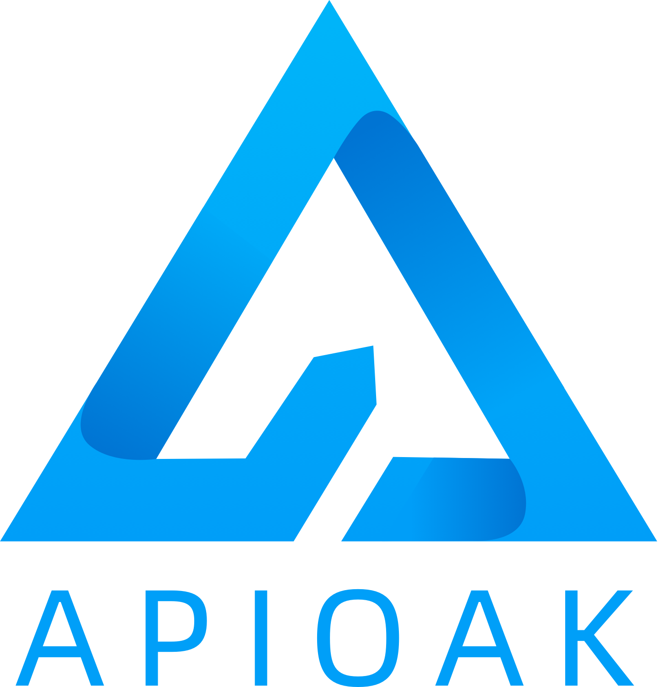

<p align="center">
  
</p>

<p align="center">

  <a href="https://github.com/apioak/apioak-dashboard">
    
  </a>

  <a href="https://github.com/vuejs/vue">
    
  </a>

  <a href="https://github.com/vueComponent/ant-design-vue">
    
  </a>

  <a href="https://www.npmjs.com/package/vue">
    
  </a>

  <a href="https://github.com/nodejs/release">
    
  </a>
  
</p>
</p>

[简体中文](README_CN.md) | [English](README.md)

## Introduction
`apioak-dashboard` is the control plane of `apioak` gateway, based on <a target="_blank" href="https://github.com/vuejs/vue">Vue 3.x</a> 、<a target="_blank" href="https://antdv.com/components/overview">ant-design-vue 3.x</a>、<a target="_blank" href="https://github.com/npm/cli">npm 6.14.13</a>  development, the project cooperates with the back-end project of the control surface <a target="_blank" href="https://github.com /apioak/apioak-admin">apioak-admin</a>.

## Quick start
<a target="_blank" href="https://github.com/apioak/apioak-dashboard">Download code from Github</a>

### Install cnpm
```
npm install -g cnpm --registry=https://registry.npm.taobao.org
```

### Install project dependencies
```
cnpm install
```

### Start the development environment
```
npm run serve
```

### Edit static files in production environment
```
npm run build
```

### Customize configuration
See [Configuration Reference](https://cli.vuejs.org/config/).

## Project directory structure
```
apioak-dashboard
├── public
└── src
    ├── api
    ├── assets
    │   ├── css
    │   ├── font
    │   └── img
    ├── components
    ├── hooks
    ├── layouts
    ├── router
    ├── schema
    │    └── plugins
    ├── store
    │   └── modules
    ├── utils
    └── views
        ├── plugin
        │   └── components
        ├── router
        ├── services
        ├── ssl
        ├── upstream
        └── user
```


